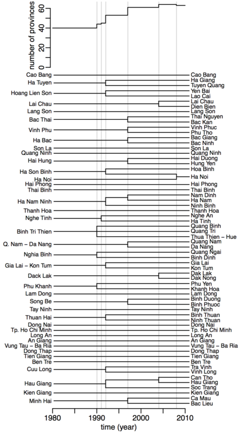

```{r include=F}
knitr::knit_hooks$set(margin = function(before,options,envir) {
if(before) par(mgp=c(1,0.35,0),bty="n",plt=c(0,.99,.13,.99), mar = c(2,2,3,2), xpd = TRUE) else NULL })

knitr::opts_chunk$set(margin=T,prompt=T,comment="",collapse=T,cache=F, bty="n",
dev.args=list(pointsize=11),fig.height= 4,
fig.width=6.24725,fig.retina=2,fig.align="center")
```

The package `poseid` contains different tools. The function `merge_prov` demonstrate in this vignette provides a method that efficiently generates time series with common spatial definitions over a given time range.
To demonstrate this function, we will use the data from the `gso` package.

Installing the `poseid` and `gso` packages:

```{r eval=F}
devtools::install_github("choisy/poseid")
devtools::install_github("choisy/gso")
```

Loading and attaching the `poseid` and `gso` packages:

```{r}
library(poseid)
library(gso)
library(magrittr)
library(dplyr)
```

## Loading data

For more detail, on how to use the gso package, please look at the vignette `Introduction to GSO` contains in the `gso` package.
For example, we use the data frame containing the information on the `birth and death rate`:

```{r}
sel <- grep("Crude birth rate, crude death rate and natural increase rate by province", 
            gso::content$`data_frame`)
gso::content$data_name[sel]
demo <- gso::content %>% filter(data_name == "demography_10") %>% .$data %>% .[[1]]
head(demo)
```

The data are expressed by year and by province:

```{r}
range(demo$year)
unique(demo$province)
```

## Merging data

The first utility of this function is to generate appropriate time series. One specificity of Vietnam is the splits of administrative provinces during its history, starting from 40 provinces in 1980 and ending with 63 provinces today, as illustrated below:

<center></center>

We can see that most of the events are splits event of one province into two or three provinces. There is only one merging event of provinces: Ha Noi and Ha Tay in 2008, which merged together to create a new spatial definition of Ha Noi. If the time range starts before 1992 and ends after 2008, the provinces: "Ha Son Binh", "Ha Noi", "Ha Tay" and "Hoa Binh" are all merged together and named "Ha Noi".

The spatial definition of the provinces is changing over time. The different data frames in the `gso` package contain provinces that are thus defined over various time durations and different spatial units in time.

In order to analyze the data correctly, it is useful to work on time series that cover the same time range and with the same spatial definition through time. 
The function `merge_prov` takes care of this by back-merging all the provinces together and returns the data in the same spatial conformation through time.

More information on this function can be found: 

```{r}
?merge_prov
```

To have a better view of how the function works, we will select only view provinces concerned by some events of splitting or merging.
For that, we will need the `dplyr` package:

```{r, message=FALSE}
library(dplyr)
```

```{r}
demo <- filter(demo, is.element(province, 
                c("Ha Noi", "Hoa Binh", "Ha Tay", "Ha Son Binh", "Dak Lak", "Dak Nong")) == TRUE)
head(demo)
unique(demo$province)
```

For example, if we want to express the area of forest with the province definition of 2000:

```{r}
mdemo <- merge_prov(demo, from = "2000-01-01")
head(mdemo)
unique(mdemo$province)
```

### Time range

Automatically, the time range selected is `from` to `to = 2017-12-31`. But we can change the time-range, we can use the parameters `from` and `to`, the only restriction is that the time-range selected overlaps the time range of the data frame inputted. 

```{r}
mdemo <- merge_prov(demo, from = 1990, to = 2010)
head(mdemo)
unique(mdemo$province)
range(mdemo$year)
```

### Functions

By default, the province are merged back together by applying the function `sum`. We can change this by using the function `FUN`. 
For example, here, it can be more interesting here to calculate the mean than the sum when merging back together the provinces. 

```{r}
merge_prov(demo, from = 1990, to = 2010, FUN = mean)
```

We can also use the weighted mean by providing the weighted in another data frame, for example by the size of the population. 
For that, we can use the data frame `pop_size` provides in the `gso` package. The data are expressed in thousand people so need a small change.

```{r}
pop_size <- gso::content %>% filter(data_name == "demography_5") %>% .$data %>% .[[1]]
pop_size <- mutate_if(pop_size, !is.element(names(pop_size), c("province", "year")), list(~ 1000 * .))
head(pop_size)
```

We can now use the pop_size information in the function with the parameters `df2` and `args` to calculate the weighted mean by the total size of the population.
The parameter `df2` take data frame as entry and the parameters `args` should indicate the name of the column containing the weight we want to apply on the data. 
The parameters `df` and `df2` should have at least one column in common to be able to join them together. 

```{r}
merge_prov(demo, from = 1990, FUN = weighted.mean, df2 = pop_size, args = "total")
```

### Selected columns

We can choose also to apply the merge_prov only on certain columns via the parameter: `sel`. 

```{r}
merge_prov(demo, sel = "crude_birth_rate", from = 1990, FUN = weighted.mean, df2 = pop_size, args = "total") 
```

### Linked to gdpm

It can be interesting to link the epidemiological data from the `gdpm` package with the information from the `gso` package.  

In the `gdpm` package, for two diseases: "hepatitis" and "amoebiasis", the story of splits/combined provinces are different, the events of 1990 take place in 1991.
For more information:
```{r, eval = FALSE}
devtools::install_github("choisy/gdpm", build_vignettes = TRUE) # to install the gdpm package
vignette(package = "gdpm")
```
```{r}
library(gdpm)
?getid
```

```{r}
hepatitis <- getid(hepatitis, from = 1990, to = 2017)
```

So, if we want the data frames to be express with the same province as the `hepatitis` or `amoebiasis` data frame, we can use the parameter `diseases`, it will automatically merge back together the province together accordingly to the `hepatitis` or `amoebiasis` history.

```{r}
demo <- gso::content %>% filter(data_name == "demography_10") %>% .$data %>% .[[1]]
mdemo <- merge_prov(demo, sel = "crude_birth_rate", from = 1990, FUN = weighted.mean,
                    df2 = pop_size, args = "total") 
unique(mdemo$province)
identical(unique(hepatitis$province), unique(mdemo$province))
```

```{r}
mdemo <- merge_prov(demo, sel = "crude_birth_rate", from = 1990, FUN = weighted.mean,
                    df2 = pop_size, args = "total", diseases = "hepatitis") 
unique(mdemo$province)
identical(unique(hepatitis$province), unique(mdemo$province))
```

