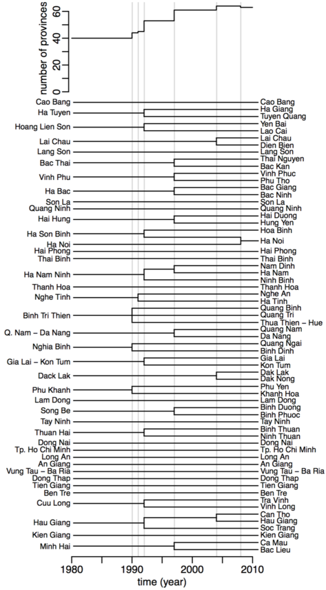

```{r include=F}
knitr::knit_hooks$set(margin = function(before,options,envir) {
if(before) par(mgp=c(1,0.35,0),bty="n",plt=c(0,.99,.13,.99), mar = c(2,2,3,2), xpd = TRUE) else NULL })

knitr::opts_chunk$set(margin=T,prompt=T,comment="",collapse=T,cache=F, bty="n",
dev.args=list(pointsize=11),fig.height= 4,
fig.width=6.24725,fig.retina=2,fig.align="center")
```

The package `poseid` contains different tools for visualization. We will used the data from the `gdpm` package to demonstrate them. 

Installing the `poseid` and `gdpm` packages:

```{r eval=F}
devtools::install_github("choisy/gdpm")
devtolls::install_github("choisy/poseid")
```

Loading and attaching the `poseid` and `gdpm` packages:

```{r}
library(gdpm)
library(poseid)
```

The data can be downloaded by using the `getid` function (see vignettes `Using gdpm`, for more information).
```{r}
dengue <- getid(dengue, from = 2000)
head(dengue)
```

## Heatmap

### Draw heatmap

A heatmap is a graphical representation of data where the individual values contained in a matrix are represented as colors (Wikipedia). The function `sthm` contains in the package `poseid`, permits to draw a heatmap of the incidence per month and per province for each disease. Each pixel represents the value of incidence for one province for one month.
More information on this function can be found: 

```{r, eval = FALSE}
?poseid::sthm
```

Prior to use this function, the data need to be prepared, because as you can see in the documentation, the input of the function sthm is a data frame of three columns: one of class `character`, one `Date` and one `numeric`. 

```{r}
str(dengue)
```

```{r, message=FALSE}
# the dengue dataframe need to be transform before visualization and we need the `dplyr` package for that.
#install.package("dplyr")
library(dplyr)
```

To prepare the data, we use three steps. The first step is to mutate the `month` and `year` columns in a column `time` in a Date format. Then, we select only the three columns necessary: here, we wanted to represent the incidence of dengue through time and space in Vietnam. And finally, we order the data contained in the data frame by time, to be sure to have a continuous representation in time. 

```{r}
# Need to have the time expressed in one column in a Data format
dengue <- mutate(dengue, 
                 time = as.Date(paste0(year, "-", as.numeric(month), "-", 15)))
dengue <- arrange(dengue, time)
dengue <- select(dengue, province, time, contains("incidence"))
# We can check now that dengue is in a good format.
str(dengue)
```

And print a heatmap:
```{r, }
sthm(dengue)
```

As we can see, there is no legend in the sthm function. But the function return invisibly, the text of the legend and the package `poseid` provides a function called `legend2` which can be used in this case. 

To see more information about the function `legend2`:

```{r, eval=FALSE}
?legend2
```

```{r}
a <- sthm(dengue)
# we use the parameter of sthm to complete the legend2 parameters, by default col = heat.colors(12), x = 0.85
legend2(.9, 1, legend =  a, col = heat.colors(12), postext = "right", h = 1/(length(a) - 1), w = 0.04, tl = 0.01, s = 0.005)
```

### Colors

A high number of color can be used to reveal more contrast. When the number of color is higher than 12 colors, the legend text is transform in a vector of equally spaces "round" values.

```{r}
col <- rev(heat.colors(200))
```

```{r}
a <- sthm(dengue, col = col)
# we use the parameter of sthm to complete the legend2 parameters
legend2(.9, 1, legend =  a, col = col, postext = "right", h = 1/(length(a) -1), w = 0.04, tl = 0.01, s = 0.005)
```

### Transformation

The inputted value can be transformed (by using the square root matrix, ...), in order to reflect better the contrasts:

```{r}
a <- sthm(dengue, f = sqrt, col = col)
legend2(.9, 1, legend =  a, col = col, postext = "right", h = 1/(length(a) -1), w = 0.04, tl = 0.01, s = 0.005)
```

```{r}
a <- sthm(dengue, f = function(x) x^.3, col = col)
legend2(.9, 1, legend =  a, col = col, postext = "right", h = 1/(length(a) -1), w = 0.04, tl = 0.01, s = 0.005)
```

### Missing value

By default, the missing value is colored in grey but the parameter can be changed by using `col_na`. This can permit a better contrast between the data and the missing values. 

```{r}
dengue <- getid(dengue)
# data preparation
dengue <- mutate(dengue, time = as.Date(paste0(year, "-", as.numeric(month), "-", 15)))
dengue <- select(dengue, matches("province"), matches("time"), contains("incidence"))
dengue <- arrange(dengue, time)

str(dengue)
```

By default, the missing value is in grey. To print the missing value in the legend, you have to use the `col_na` parameter in the `legend2` function.

```{r}
a <- sthm(dengue, f = function(x) x^.3, col = col)
legend2(.9, 1, legend =  a, col =  col, postext = "right", col_na = "grey", size_na = 0.05, h = 1/(length(a) -1), w = 0.04, tl = 0.01, s = 0.005)
```

But you can change it to `black` or another color by using the `col_na` parameter and also you can change the size of the NA square in the legend by using the `size_na` parameter:

```{r}
a <- sthm(dengue, f = function(x) x^.3, col = col, col_na = "black")
legend2(.9, 1, legend =  a, col =  col, postext = "right", col_na = "black", size_na = 0.03, h = 1/(length(a) -1), w = 0.04, tl = 0.01, s = 0.005)
```

### Order the provinces

By default, the provinces are in an alphabetical order, but, by using the coordinates contained in the gadmVN package, we can order them by latitude:

```{r , message = FALSE}
library(gadmVN)
library(sp)
library(sf)
```

First, you can extract the coordinates information by provinces and ordered them by latitudes (by creating an index).

```{r}
# extract the coordinates of each province
provinces <- gadmVN::gadm(date = "1980-01-01", merge_hanoi = TRUE)
provinces <- sf::as_Spatial(provinces)
coord <- sp::coordinates(provinces)
row.names(coord) <- unique(provinces@data$province)
head(coord)
# order the provinces by latitude and create an index called "order"
order <- rownames(coord[order(coord[, 2]), ])
order <- data.frame(province = order, order = seq_along(order))
head(order)
```

Second, you can link the data frame containing the index of the ordered province to the infectious diseases data frame by provinces and ordered them by latitudes:

```{r}
dengue <- left_join(dengue, order, by = "province")
dengue <-  arrange(dengue, order)
head(dengue)
```

```{r}
dengue_or <- select(dengue, -order)
str(dengue_or)
```

Finally, you can visualize the data ordered by latitudes by using the `sthm` function who will create a heatmap by keeping the province in the same order as the output. You can even print the province name (ordered) by using the `show_legend` parameters. When this parameter is filled as `TRUE`, a list is printed containing both the `legend` and the `province`. Here, the output shows the provinces from the South (bottom of the figure) to the North (top of the figure) of Vietnam.

```{r}
a <- sthm(dengue_or, f = function(x) x^.3, col = col, show_legend = TRUE)
# a is a list containing both the legend and the province. To print the scale legend with legend2, it is important to specify 'a$legend'
legend2(.9, 1, legend =  a$legend, col = col, postext = "right", h = 1/(length(a$legend) -1), w = 0.04, tl = 0.01, s = 0.005)
str(a)
```

A map of the province can be printed on the left of the heatmap with the parameters `map` and `xm`. And the province will be automatically linked between the map and the heatmap. 

```{r}
a <- sthm(dengue_or, f = function(x) x^.3, col = col, map = provinces, xm = 0.25, show_legend = TRUE)
legend2(.9, 1, legend =  a$legend, col = col, postext = "right", h = 1/(length(a$legend) -1), w = 0.04, tl = 0.01, s = 0.005)
str(a)
```

### In a pipe

The entire process can be made in a pipe by using the `magrittr` package.

```{r}
#install.package("magrittr")
library(magrittr)
```

```{r}
# Geographic data
provinces <- gadmVN::gadm(date = "1980-01-01", merge_hanoi = TRUE)
provinces <- sf::as_Spatial(provinces)
coord <- sp::coordinates(provinces)
row.names(coord) <- unique(provinces@data$province)
# Order the provinces by latitude and create an index called "order"
order <- rownames(coord[order(coord[, 2]), ])
order <- data.frame(province = order, order = seq_along(order))

# Color vector
col <- rev(heat.colors(100))

# Pipe
getid(dengue) %>%
  mutate(time = as.Date(paste0(year, "-", as.numeric(month), "-", 15))) %>%
  select(province, time, contains("incidence")) %>% 
  left_join(order, by = "province") %>% 
  arrange(order) %>%
  select(-order) %>% 
  arrange(time) %>%
  sthm(f = function(x) x^.3, col = col, map = provinces, xm = 0.25) %>%
  legend2(.9, 1, legend =  ., col = col, postext = "right",
          h = 1/(length(.)-1), w = 0.04, tl = 0.01, s = 0.005)
```

## Choropleth map

A choropleth map is a thematic map in which areas are shaded or patterned in proportion to the measurement of the statistical variable being displayed on the map, such as population density or mortality rate... (Wikipedia).
The function 'choromap' is also contained in the package `poseid`. For more information: 

```{r, eval = FALSE}
?choromap
```

### Data preparation

Like the `sthm` function, the data need also preparation.
For the epidemiologic data, the first step is to select only the month and the year that we want to represent, here the incidence value of dengue in September 1993. We keep only the 'province' and 'incidence_dengue' column as the 'choromap' function accepts only data frame with two columns, one of class `character` containing the geographical definition and one of class `numeric` containing the value to represent.

```{r}
# Preparation data spatial and epidemiologic
# dengue data
dengue <- getid(dengue, from = 1993, to = 1993)
dengue_0993  <- filter(dengue, year == 1993, month == "September")
dengue_0993 <- select(dengue_0993, province, contains("incidence"))

```

### Select class intervals and colors

The second step is the choice of the class intervals. 

The function `breaks` in the `poseid` package permit to select the class intervals for a numeric column in a data frame and return the data frame with the breaks in attributes.
For more details:

```{r}
?poseid::breaks
```

The `breaks` function use the function `classIntervals` from the package `classInt`. Many different methods of selection of intervals are implemented in the function and you can try different method just by changing the `style` parameters. 
For more details:

```{r, eval = FALSE}
?classInt::classIntervals
```

Here, we show the example of the `quantile` and the `fisher` methods. The function `breaks` has a parameter `distrib`, which permits to print the distribution of the value by breaks. It allows you to see the difference in distribution between different `style`. 

```{r}
# plot Quantile
q_breaks <- poseid::breaks(dengue_0993, "incidence_dengue", pal = rev(heat.colors(6)), distribution = TRUE)
attr(q_breaks, "breaks")
```

Here, the distribution of the data is very different from class, each class as the same number of data. However, we can see that a lot of value will be expressed in the dark brown value. Let's see now with the Fisher-Jenkins way. 

```{r}
# plot Fisher - Jenkins
f_breaks <- poseid::breaks(dengue_0993, "incidence_dengue", style = "fisher" ,pal = rev(heat.colors(6)), distribution = TRUE)
attr(f_breaks, "breaks")
```

The Fisher-Jenking method seems to be more equilibrate. The two different ways show very different distribution. Depending on the question or of what we want to show, it can be interesting to look at the distribution of the data by the class intervals to select the best way to cut it. 

### Choice of the map

The choice of the map is important because one specificity of Vietnam is the splits of administrative provinces during its history, starting from 40 provinces in 1980 and ending with 63 provinces today, as illustrated below:

<center></center>

We can see that most of the events are splits event of one province into two or three provinces. There is only one merging event of provinces: Ha Noi and Ha Tay in 2008, which merged together to create a new spatial definition of Ha Noi.  If the time range starts before 1992 and ends after 2008, the provinces: "Ha Son Binh", "Ha Noi", "Ha Tay" and "Hoa Binh" are all merged together and named "Ha Noi". 

The spatial definition of the provinces is changing over time. In order to represent the data correctly, it is useful to choose the map of the Vietnam corresponding in number and name of the province to our epidemiologic data.

Here, we want to represent the incidence value of dengue in September 1993, so we select a map of Vietnam of 1992. 

(See vignettes 'Using the gdpm package' for more information on the merging process and output of the function `getid`)

```{r}
# geographic data
map <- gadmVN::gadm(date = 1992)
map <- sf::as_Spatial(map)
```

### Draw a choropleth map

Now that we have identified the class intervals, we can print a choropleth map with the function `choromap` and we will use again the `legend2` function for the legend.
The `choromap` function returns invisibly the information for the legend: the breaks and the colors associated, in a vector with attributes.

```{r}
a <- choromap(dengue_0993, map, fixedBreaks = c(0, 75, 200, 490, 720, 1100, 1300), col = rev(heat.colors(6)), col_na = "grey")
# By default, the legend is on the top-left part of the figure, for more information: `?legend2`
legend2(legend = a, col = attr(a, "colors"), col_na = "grey")
```

Like the `sthm` function, the color of the missing value can be changed with the parameter `col_na`, and the color with the parameter `pal`. The `pal` parameter should be of the length of the parameter `fixedBreaks` - 1.

### In a pipe

The entire process can be made in a pipe by using the `magrittr` package

```{r}
# Geographical information
map <- gadmVN::gadm(date = 1992)
map <- sf::as_Spatial(map)

# Pipe
getid(dengue, from = 1992, to = 1993) %>%
  filter(year == 1993, month == "September") %>%
  select(province, contains("incidence")) %>%
  breaks("incidence_dengue",n = 6, style = "fisher",
         pal = rev(heat.colors(6))) %>%
  choromap(., map, fixedBreaks = attr(., "breaks"),
           col = rev(heat.colors(6)), col_na = "gray") %>%
  legend2(legend = ., col = attr(., "colors"), col_na = "gray")
```

You can also print the distribution of the value by class intervals in the pipe, it will print two different plots. 

```{r}
getid(dengue, from = 1992, to = 1993) %>%
  filter(year == 1993, month == "September") %>%
  select(province, contains("incidence")) %>%
  breaks("incidence_dengue",n = 6, style = "fisher",
         pal = rev(heat.colors(6)), distribution = TRUE) %>%
  choromap(., map, fixedBreaks = attr(., "breaks"),
           col = rev(heat.colors(6)), col_na = "gray") %>%
  legend2(legend = ., col = attr(., "colors"), col_na = "gray")
```

